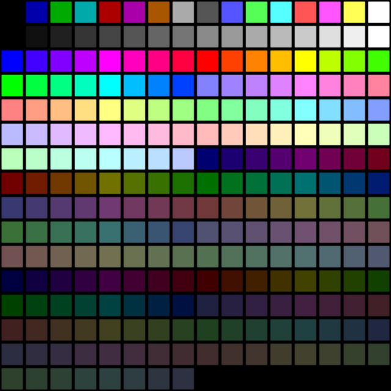

# 从零开始让计算机显示图像

Legacy BIOS VGA 编程

## 上期视频内容

上期视频 av441549245 介绍了 BIOS MBR 编程基础

介绍了 x86 实模式、BIOS 引导 MBR 丄0x7c00 内存地址、BIOS 中断调用

介绍了段寄存器 ds

介绍了 loop 指令和 cx 寄存器

在线 x86 汇编语言编译器 https://disasm.pro/

在浏览器中的十六进制编辑器 https://hexed.it/

在浏览器中运行的 x86 虚拟机 https://copy.sh/v86/

Rufus: U 盘启动盘制作工具 https://rufus.ie/downloads/

## 工具

只需要使用浏览器就够了，视频中的编程都在浏览器中完成。

没有配置开发环境的过程，每个人都可以上手尝试。

你还需要准备一个 U 盘，用于制作启动盘。

## VGA 硬件介绍

我们需要使用 VGA 硬件来显示图像。VGA 不只是指 VGA 接口，它也是早期的一个标准。

VGA 硬件提供了多种显示模式，例如启动时的文本模式是 0x03。我们可以切换到 0x13 图形模式，这是 320x200 分辨率 256 色的模式。较新的 VGA 硬件还有其他更多的模式。(注意: 这些功能都是 VGA 硬件提供的，不是 BIOS 提供的，BIOS 只是封装了一些常用功能)

显示适配器和 GPU 是两种东西，显示适配器是将特定显存位置的数据内容输出到视频线接口，而 GPU 负责在显存中做各种图形相关的并行计算。现在的显卡通常同时有两种的功能，而 USB 转 VGA 的转接头通常只有显示适配器功能。

现在的显卡还有较新的显示标准，但同时也兼容了 VGA 的功能。

## VGA 基础编程

BIOS 封装了一部分常用的操作 VGA 硬件的功能，比如将 VGA 硬件切换到 0x13 模式：

```asm
mov ah, 0
mov al, 0x13
int 0x10
```

在 0x13 模式下，直接写入位于地址空间中 0xa0000 ~ 0xaffff 处的显存，即可直接控制屏幕显示。0x13 模式是 320x200 分辨率 256 色的模式，总共 64000 个像素点，这段地址的前 64000 字节对应这些像素，每个字节有 256 个值，对应 256 色调色盘。

这种显示方法没有“垂直同步”，因此画面可能会“撕裂”。

## VGA 256 色默认调色盘



第一行基础颜色，对应索引值是 0~15

第二行不同亮度的灰色，对应索引值是 16~31

然后是 6 组不同亮度和饱和度的颜色每组 24 色，索引值为 32~247

最后是未使用的 8 个黑色

这只是默认调色盘，调色盘是可以修改的。

来源：https://en.wikipedia.org/wiki/Video_Graphics_Array#Color_palette

## VGA 基础编程 2

举个例子，先将 ds 段寄存器设为 0xa000，然后将 ds:[0x0] 设为 15 ，这样就会将 15 写入 0xa0000 这个地址，这样就会将屏幕最左上角显示白色。

```asm
mov ah, 0
mov al, 0x13
int 0x10

mov bx, 0xa000
mov ds, bx

mov bl, 15
mov ds:[0x0], bl

end:
hlt
jmp end
```

配合 loop 指令填充所有 64000 个像素。

```asm
mov ah, 0
mov al, 0x13
int 0x10

mov bx, 0xa000
mov ds, bx

mov bx, 0
mov cx, 64000
start:
mov ds:[bx], bh
inc bx
loop start

end:
hlt
jmp end
```

## 有色差的地方就有 Bad Apple

## 读取硬盘

BIOS 提供了读取硬盘的功能。我们可以将画面存储在硬盘中，将硬盘读取到内存，再从内存复制到显存，这样就能显示图片。

早期 BIOS 提供了 CHS (Cylinder Head Sector 柱面、磁头、扇区)寻址方式读取硬盘，较新的 BIOS 都提供了通过 LBA (Logical block addressing) 寻址方式读取硬盘。

LBA 寻址方式将整个硬盘视为一个线性的空间，只需要提供起始扇区号和读取扇区数量即可进行读取。

在 x86 实模式下，0x7e00 ~ 0x7ffff 之间的约 480 KB 内存都是我们的程序可以自由使用的，我们可以用这块内存暂存要显示的内容。

我们可以先在地址 0x7c80 处定义所需的结构体，表明我们要读取硬盘的信息。然后让 ds:si 寄存器指向这个结构体，最后使用 int 0x13 (ah=0x42) 中断来让 BIOS 通过 LBA 寻址方式读取硬盘。

```plain
0x7c80 数据: (请注意，x86 各种整数的存储方式都是小端序)
10                      ; 结构体大小(固定为 16)
00                      ; 未使用(固定为 0)
7d 00                   ; 读取的扇区数量(每扇区 512 字节)
00 7e                   ; 目标内存地址 0x7e00
00 00                   ; 目标地址的段地址 0x0000
01 00 00 00 00 00 00 00 ; 起始 LBA 扇区号(从 0 开始)
```

```asm
mov si, 0
mov ds, si      ; 将 ds 段寄存器设为 0x0000
mov si, 0x7c80  ; 将 si 设为结构体地址 0x7c80
mov ah, 0x42
mov dl, 0x80    ; 要读取的硬盘编号(当前的硬盘固定为 0x80)
int 0x13        ; 调用 BIOS 中断
```

软盘不支持 LBA 寻址方式，只有硬盘支持。

https://copy.sh/v86/ 的硬盘文件的大小至少需要一个柱面 (16 磁头×63 愵嬫×每扇区 512 字节 = 516,096 字节)。

读取 64000 字节等于读取 125 扇区。

## 内存拷贝

x86 CPU 提供了 movsb 这个指令来将 ds:si 指向地址的 1 字节拷贝到 es:di 指向地址处，执行结束后自动将 si 和 di 都增加 1 字节。

x86 CPU 还提供了一个 rep 前缀，rep movsb 会将 movsb 反复执行 cx 次。我们这个场景则应该循环 64000 次。

需要注意 movsb 在 si 或 di 达到 0xffff 之后不会自动增加段寄存器的值，所以将 0x7e00 内存拷贝到 0xa0000 处，不能直接设置 si 为 0x7e00，而应该将 ds 设置为 0x7e0，将 si 设为 0。

```asm
mov si, 0x7e0
mov ds, si
mov si, 0
mov di, 0xa000
mov es, di
mov di, 0
mov cx, 0xfa00
rep movsb
```

## 使用 DevTools 构造 VGA 图片数据

现在的浏览器 F12 的 DevTools 开发者工具几乎是一个万能的脚本工具。

HTML5 的 canvas 元素提供了很多绘图相关的功能。

可以使用 drawImage 方法可以将图片或者视频当前帧画面会绘制到 canvas 元素上，然后再使用 getImageData 方法获取所有像素的 RGBA 值。

getImageData 返回值里面包含一个 uint8 数组，排列方式为：先是第 1 个像素的 R、G、B、A，然后是第 2 个像素的 R、G、B、A，依此类推，每个像素的每个通道占 1 字节，数组总长度是图像的像素数量乘以 4。

黑白颜色转成 VGA 颜色索引可以简单的将红色通道的 0~255 均匀映射到 16~31 范围。

```javascript
const canvas = document.createElement('canvas');
document.body.prepend(canvas);
canvas.width = 320;
canvas.height = 200;
canvas.style.position = 'fixed';
canvas.style.zIndex = 10000;
canvas.style.border = '2px solid #f00';
const ctx = canvas.getContext('2d', { willReadFrequently: true });
const video = document.querySelector('video');
ctx.drawImage(video, 0, 0, canvas.width, canvas.height);
const imageData = ctx.getImageData(0, 0, canvas.width, canvas.height);
const frameVGABytes = imageData.data.filter((_, i) => i % 4 === 0).map(x => 16 + Math.floor(x / 256 * 16));
console.log(Array.from(frameVGABytes).map(x => x.toString(16)).join(' '));
```

## 读取下一帧

将 0x7c80 位置那个结构体中的起始扇区号修改一下，就可以读下一帧了。

每帧 64000 字节，对应是 125 扇区，16 位寄存器范围内只能播放 524 帧 (大约 28 秒)。

不过，好消息是，虽然我们处在实模式中，寻址只有 16 位 ，但是我们仍然可以进行 32 位的计算。正常使用 eax ebx 等 32 位寄存器，可以正常编译，不用怕视频总帧数受限啦。

那么总共重复多少次呢？我们可以判断第一个字节是否为 0 ，为 0 时表示不再继续读取下一帧。因为索引值 0 和 16 都是黑色，我们可以让正常数据中永远不出现 0，如果出现 0 就表示画面结束。

```asm
mov ah, 0
mov al, 0x13
int 0x10

start:
mov si, 0
mov ds, si
mov si, 0x7c80
mov ah, 0x42
mov dl, 0x80
int 0x13

mov si, 0x7e0
mov ds, si
mov si, 0
mov di, 0xa000
mov es, di
mov di, 0
mov cx, 0xfa00
rep movsb

mov al, ds:[0x0]
test al, al
jz end

sti
hlt
mov bx, 0
mov ds, bx
mov eax, ds:[0x7c88]
add eax, 125
mov ds:[0x7c88], eax
jmp start

end:
hlt
jmp end
```

## 定时器中断

hlt 指令会让 CPU 暂停，然后只有硬件中断能让 CPU 重新运行并处理中断。

hlt 指令之前一般会有一个 sti 指令允许 CPU 接收外部中断，否则就相当于卡死了。

不过如果之前没有通过 cli 指令关闭外部中断，可以不执行 sti。

主板上有一个硬件 PIT (Programmable Interval Timer, 可编程间隔定时器) ，他可以定时触发中断，PIT 默认的触发频率为 18.2065 Hz。

PIT 内部的晶振的频率是 1193182 Hz，默认情况下 PIT 内部的芯片控制是每 65536 次脉冲触发一次中断，这个次数通过 out 指令操作进行修改。

这里为了简单，我们就不去修改 PIT 的频率了。

同样是为了简单，我们只利用他能恢复 hlt 状态的功能，我们不去修改中断处理函数。只要写一个 hlt 指令，程序就会暂停大约 55ms 然后程序再继续运行。

## 使用 DevTools 构造 VGA 视频数据

使用 video.currentTime 获取当前时间，按每秒 18.2065 帧的速率将视频画面转成 VGA 数据储存下来。

```javascript
const blobParts = [];
let prevFrameIndex = null;
const timerId = setInterval(() => {
    const frameIndex = Math.floor(video.currentTime * 18.2065);
    if (frameIndex !== prevFrameIndex) {
        ctx.drawImage(video, 0, 0, canvas.width, canvas.height);
        const imageData = ctx.getImageData(0, 0, canvas.width, canvas.height);
        const frameVGABytes = imageData.data.filter((_, i) => i % 4 === 0).map(x => 16 + Math.floor(x / 256 * 16));
        blobParts.push(frameVGABytes);
        prevFrameIndex = frameIndex;
    }
    if (blobParts.length > 182) {
        clearInterval(timerId);
        blobParts[blobParts.length - 1][0] = 0;
    }
}, 16);
```

[使用 DevTools 构造 VGA 视频数据.js](./%E4%BD%BF%E7%94%A8%20DevTools%20%E6%9E%84%E9%80%A0%20VGA%20%E8%A7%86%E9%A2%91%E6%95%B0%E6%8D%AE.js)

可以使用 file-saver.js 通过浏览器下载的方式导出这些数据。导出需要构造一个 Blob 对象。Blob 对象由多个分块组成，每块都是一个字节数组。浏览器下载后就是把他们连在一起合成的一个文件。

```javascript
const script = document.createElement('script');
script.src = 'https://unpkg.com/file-saver';
document.head.append(script);

const blob = new Blob(blobParts);
saveAs(blob, 'mbr.bin');
```

我们可以直接将 MBR 的 512 字节一起放入 Blob 对象，这样就不需要十六进制编辑器了。

彩色 RGB 转 VGA 颜色索引值算法稍微复杂，如果想查看代码可以访问链接。

https://github.com/ganlvtech/simple-bios-vga-video

[使用 DevTools 构造彩色 VGA 视频数据.js](./%E4%BD%BF%E7%94%A8%20DevTools%20%E6%9E%84%E9%80%A0%E5%BD%A9%E8%89%B2%20VGA%20%E8%A7%86%E9%A2%91%E6%95%B0%E6%8D%AE.js)

## 那么，正片开始。

快来体验一下开机之后就立刻看到显示器上出现视频的喜悦吧

## 其他说明

BIOS (基础输入输出系统) 只提供了键盘输入和显示输出的功能。声音没法简单的播放，如果你想了解，可以去了解 Intel High Definition Audio，不过这个硬件协议比较复杂。

如果要输出声音，那么相当于学习编写驱动程序了。

x86 CPU 操作外部设备的方式：x86 CPU 有两种输入输出的方式，Port Mapped I/O (PMIO) 和 Memory Mapped I/O (MMIO, 基于内存映射的输入输出)，PMIO 需要使用 in 和 out 指令完成，MMIO 直接使用 mov 等内存操作指令完成。

北桥芯片 (Northbridge 又名 MCH, Memory Controller Hub) 是连接着 CPU、内存条、显卡、南桥等设备的中枢。使用 MMIO 方式操作输入输出时，北桥会将 CPU 对内存地址的操作，转换为内存、显卡等不同硬件的操作。

不过，最新的 CPU 已经将集成了北桥的功能，内存和 PCIe 通道都是直连 CPU 的了。现在新的 CPU 引脚越来越多了。

如果你还想了解更多内容，可以询问 ChatGPT ，他给出的解答非常完美。

## 参考资料

* https://wiki.osdev.org/VGA_Hardware
* https://wiki.osdev.org/Memory_Map_(x86)
* https://upload.wikimedia.org/wikipedia/commons/6/66/VGA_palette_with_black_borders.svg
* http://www.columbia.edu/~em36/wpdos/videomodes.txt
* http://www.ctyme.com/intr/int-13.htm
* https://wiki.osdev.org/Programmable_Interval_Timer
* https://www.intel.com/content/dam/www/public/us/en/documents/datasheets/4-chipset-family-datasheet.pdf
* https://download.intel.com/design/processor/datashts/31327807.pdf
* https://www.bilibili.com/video/av24722
* https://www.bilibili.com/video/av514713203
* https://www.bilibili.com/video/av696583003

BGM: Roa – Sora (https://roa-music.com/)
